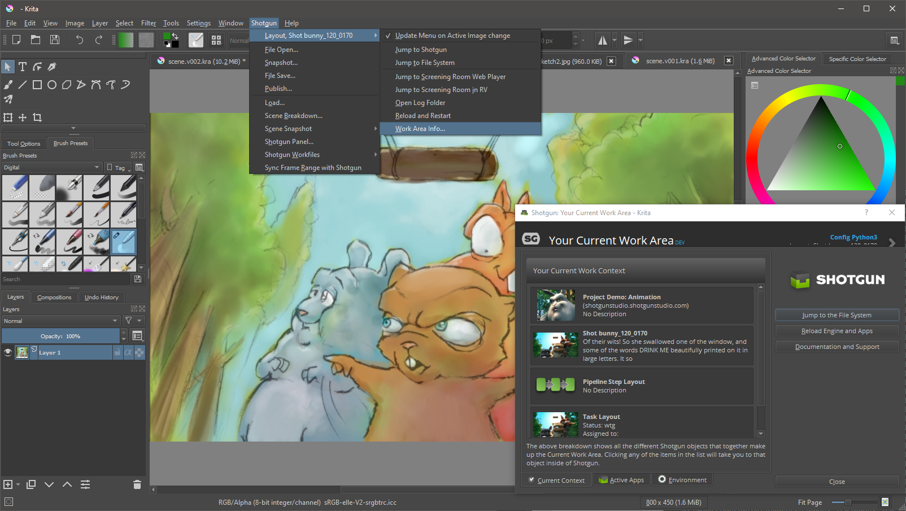
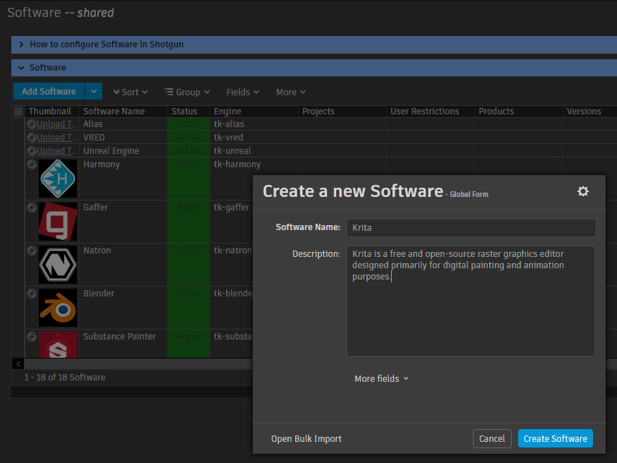
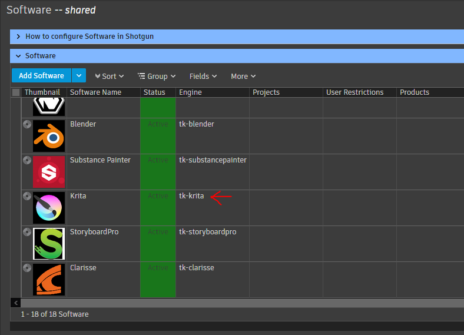
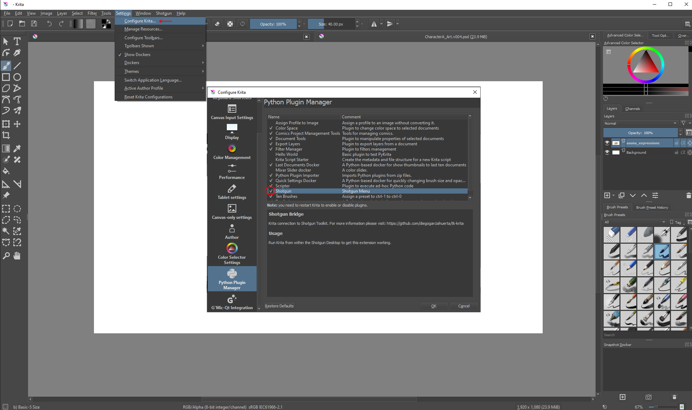
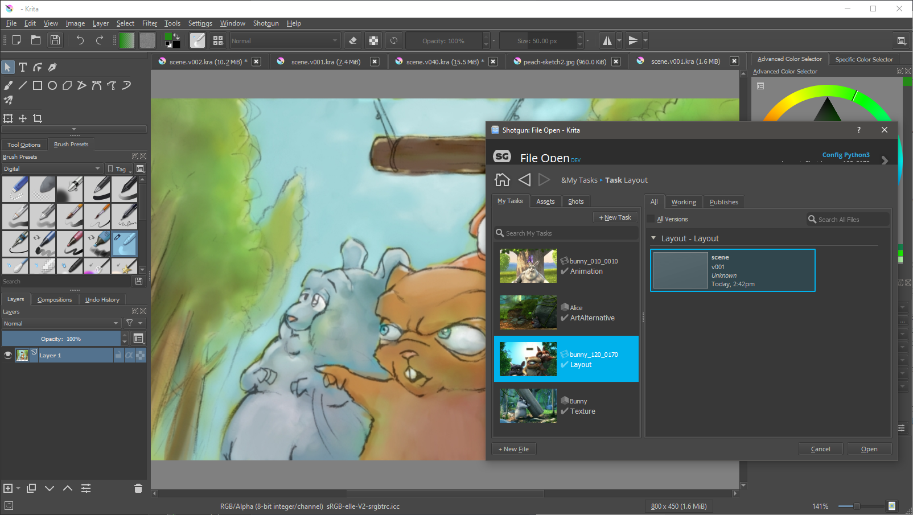
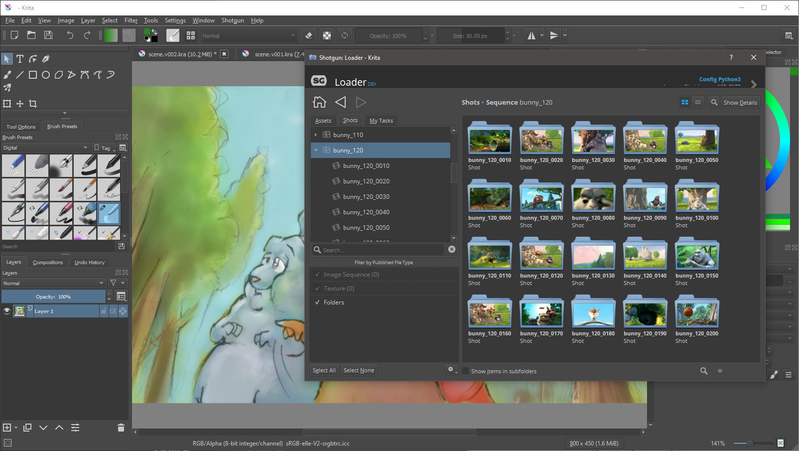
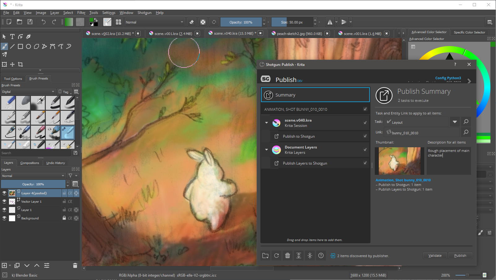
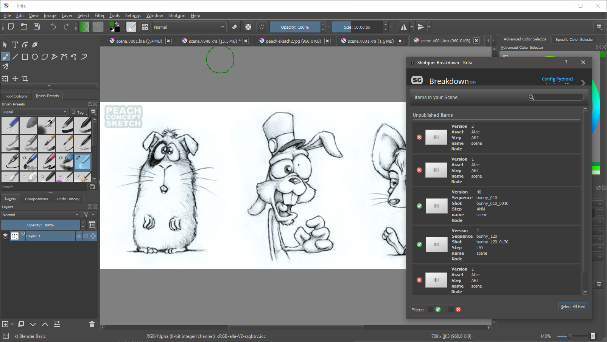
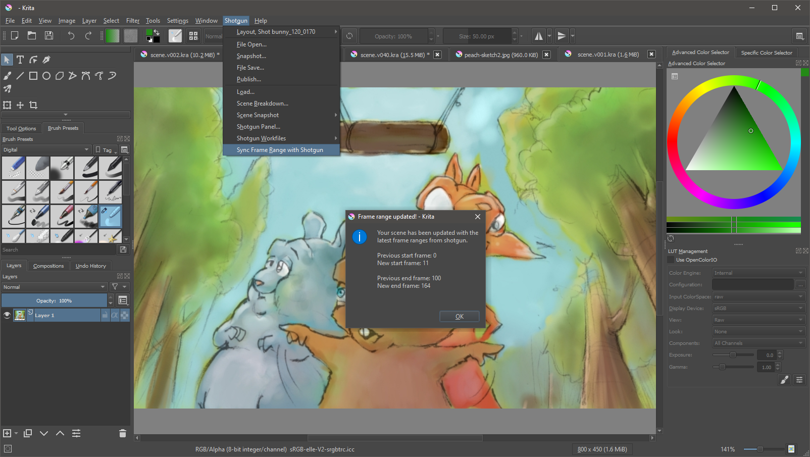

# Shotgun toolkit engine for Krita

Contact : [Diego Garcia Huerta](https://www.linkedin.com/in/diegogh/)



## Overview

Implementation of a shotgun engine for [**Krita**](https://krita.org). It supports the classic bootstrap startup methodology and integrates with Krita adding a new Shotgun Menu in the main Krita tool-bar. 

* [Engine Installation](#engine-installation)
* [Configuring your project for Shotgun Toolkit](#configuring-your-project-for-shotgun-toolkit)
* [Modifying the toolkit configuration files to add this engine and related apps](#modifying-the-toolkit-configuration-files-to-add-this-engine-and-related-apps)
* [Modifying the Templates](#modifying-the-templates)
* [Configuring Krita in the software launcher](#configuring-krita-in-the-software-launcher)
* [Caching and downloading the engine into disk](#caching-and-downloading-the-engine-into-disk)
* [Krita engine should be ready to use](#krita-engine-should-be-ready-to-use)
* [Toolkit Apps Included](#toolkit-apps-included)

With the engine, hooks for most of the standard tk applications are provided:

* [tk-multi-workfiles2](#tk-multi-workfiles2)
* [tk-multi-snapshot](#tk-multi-snapshot)
* [tk-multi-loader2](#tk-multi-loader2)
* [tk-multi-publish2](#tk-multi-publish2)
* [tk-multi-breakdown](#tk-multi-breakdown)
* [tk-multi-setframerange](#tk-multi-setframerange)

More:
* [Krita engine options](#krita-engine-options)
* [Development notes](#development-notes)
  * [Shotgun Toolkit development notes](#shotgun-toolkit-development-notes)
  * [Krita development notes](#krita-development-notes)

**Disclaimer**

**This engine has been developed and tested in Windows 10 using Krita version 4.2.7. (Note that due to minimal changes in the Krita API, there is a chance that works with previous 4.x versions)**

The engine has not been used in production before so **use it at your own risk**. Also keep in mind that some of the hooks provided might need to be adapted to your work flows and pipelines. If you use it in production, I would love to hear about it, drop me a message in the contact link at the beginning of this documentation.


## Engine Installation

When I started using shotgun toolkit, I found quite challenging figuring out how to install and configure a new tk application or a new engine. Shotgun Software provides extensive documentation on how to do this, but I used to get lost in details, specially with so many configuration files to modify.

If you are familiar with how to setup an engine and apps, you might want to skip the rest of this document, just make sure to check the [templates](config/core/templates.yml) and [additions to the configs](config/env) that might give you a good start.

If you are new to shotgun, I also recommend to read at least the following shotgun articles, so you get familiar with how the configuration files are setup, and the terminology used:

* [App and Engine Configuration Reference](https://support.shotgunsoftware.com/hc/en-us/articles/219039878-App-and-Engine-Configuration-Reference)
* [Overview of Toolkit's New Default Configuration](https://support.shotgunsoftware.com/hc/en-us/articles/115004077494-Overview-of-Toolkit-s-New-Default-Configuration-)

Here are detailed instructions on how to make this engine work assuming you use a standard shotgun toolkit installation and have downloaded shotgun desktop.
[Shotgun Desktop Download Instructions](https://support.shotgunsoftware.com/hc/en-us/articles/115000068574#Getting%20started%20with%20Shotgun%20Desktop)

Also an amazing resource to look for help when configuring your engine, is the [Shotgun Community Forums](https://community.shotgunsoftware.com/), specifically under *Pipeline Integrations* category.

Finally, this link contains the technical reference for Shotgun toolkit and related technologies, a great effort to collate all the tech documentation in a single place:
[Shotgun's Developer Documentation](https://developer.shotgunsoftware.com/)

## Configuring your project for Shotgun Toolkit

If you haven't done it yet, make sure you have gone through the basic steps to configure your project to use shotgun toolkit, this can be done in shotgun desktop app, by:
* enter into the project clicking it's icon

* click on the user icon to show more options (bottom right)

* click on *Advanced project setup*

    

* *Select a configuration*: "Shotgun Default" or pick an existing project that you have already setup pages and filters for.


* *Select a Shotgun Configuration*: select "default" which will download the standard templates from shotgun. (this documentation is written assuming you have this configuration)


* *Define Storages*: Make sure you name your first storage "primary", and a choose a primary folder where all the 'jobs' publishes will be stored, in this case "D:\demo\jobs" for illustrative purposes.


* *Project Folder Name*: This is the name of the project in disk. You might have some sort of naming convention for project that you might follow, or leave as it is. (My advice is that you do not include spaces in the name)


* *Select Deployment*: Choose "Centralized Setup". This will be the location of the configuration files (that we will be modifying later). For example, you could place the specific configuration for a project (in this example called game_config) within a folder called "configs" at the same level then the jobs folder, something like: 
```shell
├───jobs
└───configs
    └───game_config
        ├───cache
        ├───config
        │   ├───core
        │   │   ├───hooks
        │   │   └───schema
        │   ├───env
        │   │   └───includes
        │   │       └───settings
        │   ├───hooks
        │   │   └───tk-multi-launchapp
        │   ├───icons
        │   └───tk-metadata
        └───install
            ├───apps
            ├───core
            ├───engines
            └───frameworks
```
(Note that this might not be suitable for more complex setups, like distributed configurations)


## Modifying the toolkit configuration files to add this engine and related apps

Every pipeline configuration has got different environments where you can configure apps accordingly. (for example you might want different apps depending if you are at an asset context or a shot context. The configured environments really depend on your projects requirements. While project, asset, asset_step, sequence, shot, shot_step, site are the standard ones, it is not uncommon to have a sequence_step environment or use a episode based environment either.

I've included a folder called 'config' in this repository where you can find the additions to each of the environments and configuration YAML files that come with the [default shotgun toolkit configuration repository](https://github.com/shotgunsoftware/tk-config-default2) (as of writing) 

[configuration additions](config)

These YAML files provided **should be merged with the original ones as they won't work on their own.**

As an example, for the location of the engine, we use a git descriptor that allows up to track the code from a git repository. This allows easy updates, whenever a new version is released. So in the example above, you should modify the file:
``.../game_config/config/env/includes/engine_locations.yml``

and add the following changes from this file:
[engine_locations.yml](config/env/includes/engine_locations.yml)

```yaml
# Krita
engines.tk-krita.location:
  type: git
  branch: master
  path: https://github.com/diegogarciahuerta/tk-krita.git
  version: v1.0.0
```

**Do not forget to update the version of the engine to the latest one. You can check here which one is the [latest version](https://github.com/diegogarciahuerta/tk-krita/releases)**

In your environments you should add tk-krita yml file, for example in the asset_step yml file:
``/configs/game_config/env/asset_step.yml``

Let's add the include at the beginning of the file, in the 'includes' section:
```yaml
- ./includes/settings/tk-krita.yml
```

Now we add a new entry under the engines section, that will include all the information for our Krita application:
```yaml
  tk-krita: "@settings.tk-krita.asset_step"
```

And so on.

Finally, do not forget to copy the additional `tk-krita.yml` into your settings folder.


## Modifying the Templates

The additions to `config/core/templates.yml` are provided also under the config directory of this repository, specifically:

[templates.yml](config/core/templates.yml)


## Configuring Krita in the software launcher

In order for our application to show up in the shotgun launcher, we need to add it to our list of software that is valid for this project.

* Navigate to your shotgun URL, ie. `example.shotgunstudio.com`, and once logged in, clink in the Shotgun Settings menu, the arrow at the top right of the web page, close to your user picture. 
* Click in the Software menu


* We will create a new entry for Krita, called "Krita" and whose description can be conveniently copy and pasted from [Krita entry in Wikipedia](https://en.wikipedia.org/wiki/Krita) 


* We now should specify the engine this software will use. "tk-krita"



* Note that you can restrict this application to certain projects by specifying the project under the projects column. If no projects are specified this application will show up for all the projects that have this engine in their configuration files.

If you want more information on how to configure software launches, here is the detailed documentation from shotgun.
[Configuring software launches](https://support.shotgunsoftware.com/hc/en-us/articles/115000067493#Configuring%20the%20software%20in%20Shotgun%20Desktop)


## Caching and downloading the engine into disk

One last step is to cache the engine and apps from the configuration files into disk. Shotgun provides a tank command for this. 
[Tank Advanced Commands](https://support.shotgunsoftware.com/hc/en-us/articles/219033178-Administering-Toolkit#Advanced%20tank%20commands)

* Open a console and navigate to your pipeline configuration folder, where you will find a `tank` or `tank.bat` file.
(in our case we placed the pipeline configuration under `D:\demo\configs\game_config`)

* type `tank cache_apps` , and press enter. Shotgun Toolkit will start revising the changes we have done to the configuration YAML files and downloading what is requires.


## Krita engine should be ready to use

If we now go back and forth from our project in shotgun desktop ( < arrow top left if you are already within a project ), we should be able to see Krita as an application to launch.


## Enable the Shotgun Plugin Engine within Krita

One last step! The first time that you use the integration, you will have to make sure the Shotgun Engine plugin is enabled within Krita. 

You can find this option by accessing the Plugin Manager options:
`Settings > Configure Krita > Python Plugin Manager ... > Shotgun`

Mark the Shotgun plugin as active and make sure you restart Krita from Shotgun Desktop. Once this is done, a new `Shotgun` menu will be shown in the menu bar. 




## Krita engine options:

There is one configurable option that I thought might be convenient to have. Since Krita is a multi document application (you can open more than one image at once), I decided to provide a way to automatically switch context when the user changes the active. This means that the menu would be updated when going form one image to a different one if they represent different contexts, ie. going form a Shot sketch to an Asset sketch in the `Window` menu

This is driven by an option in the engine called:
```yaml
    active_document_context_switch:
        type: bool
        description: "Controls whether the engine should attempt to automatically adjust its context every time the active document changes, ie. when the artist has multiple documents opened and switch between them."
        default_value: False

```
To make it active by default, simple add it to your tk-krita.yml as an option:
active_document_context_switch: True

Note that you can always change this behaviour via Shotgun Menu -> Context Menu -> Update Menu on Active image Change


## Toolkit Apps Included

## [tk-multi-workfiles2](https://support.shotgunsoftware.com/hc/en-us/articles/219033088)


This application forms the basis for file management in the Shotgun Pipeline Toolkit. It lets you jump around quickly between your various Shotgun entities and gets you started working quickly. No path needs to be specified as the application manages that behind the scenes. The application helps you manage your working files inside a Work Area and makes it easy to share your work with others.

Basic  have been implemented for this tk-app to work. open, save, save_as, reset, and current_path are the scene operations implemented.

Check the configurations included for more details:
[additions to the configs](config/env)

## [tk-multi-snapshot](https://support.shotgunsoftware.com/hc/en-us/articles/219033068)


A Shotgun Snapshot is a quick incremental backup that lets you version and manage increments of your work without sharing it with anyone else. Take a Snapshot, add a description and a thumbnail, and you create a point in time to which you can always go back to at a later point and restore. This is useful if you are making big changes and want to make sure you have a backup of previous versions of your scene.

 is provided to be able to use this tk-app, similar to workfiles2.

## [tk-multi-loader2](https://support.shotgunsoftware.com/hc/en-us/articles/219033078)


The Shotgun Loader lets you quickly overview and browse the files that you have published to Shotgun. A searchable tree view navigation system makes it easy to quickly get to the task, shot or asset that you are looking for and once there the loader shows a thumbnail based overview of all the publishes for that item. Through configurable hooks you can then easily reference or import a publish into your current scene.

 for this tk app supports any PublishedFile that has a Krita supported extension. The files can be loaded as new images, open as new layers and open as animated frames [open_image, open_as_layer, import_animation_frames]

## [tk-multi-publish2](https://support.shotgunsoftware.com/hc/en-us/articles/115000097513)


The Publish app allows artists to publish their work so that it can be used by artists downstream. It supports traditional publishing workflows within the artist’s content creation software as well as stand-alone publishing of any file on disk. When working in content creation software and using the basic Shotgun integration, the app will automatically discover and display items for the artist to publish. For more sophisticated production needs, studios can write custom publish plugins to drive artist workflows.

The basic publishing of the current session is provided as  for this app. 

I also provide the ability to publish the layers from a Krita session as a published folder, or as individual published layers.

Make sure you choose your desired behaviour in the configuration for this app, under the Krita section of tk-multi-publish2.yml, for example:
```yaml
# shot step
settings.tk-multi-publish2.krita.shot_step:
  collector: "{self}/collector.py:{engine}/tk-multi-publish2/basic/collector.py"
  collector_settings:
      Work Template: krita_shot_work
      Publish Layers as Folder: true
  publish_plugins:
  - name: Publish to Shotgun
  ...
```

The option above would export the layers a single folder publish. You can also configure where the folder or layers are published and the actual naming of the layer files in your `templates.yml` file.


## [tk-multi-breakdown](https://support.shotgunsoftware.com/hc/en-us/articles/219032988)


The Scene Breakdown App shows you a list of items you have loaded (referenced) in your scene and tells you which ones are out of date. In this case there is no need to update the images opened in Krita so the update button has been disabled. While somewhat a bit limited, it is still handy to know if we have opened the latest version of a sketch/image.

 is provided to display the current elements that match any template from Krita engine.

## [tk-multi-setframerange](https://support.shotgunsoftware.com/hc/en-us/articles/219033038)


This is a simple yet useful app that syncs your current file with the latest frame range in Shotgun for the associated shot. If a change to the cut has come in from editorial, quickly and safely update the scene you are working on using this app. Towards the end, it will display a UI with information about what got changed.

 is provided to set the frame range within Krita for a *shot_step* environment. I was pleasantly surprised that Krita supports [animation](https://docs.krita.org/en/user_manual/animation.html), so this app has been implemented to set the start / end time according to the current context. (Normally used in shot based contexts)

Please adjust this logic accordingly to however you want to handle frame ranges in your pipeline.

## Development notes:

The way this engine works is via a [Krita extension](resources/extensions) that triggers the instancing of the Krita toolkit engine. Once the engine is up and running, the [menus](python/tk_krita/menu_generation.py) are created as normal using PyQt5 widgets, very similar to other engines.

The biggest challenges writing this engine were first dealing with a work in progress toolkit that was being ported to Python3 as I was writing it (Krita runs in Python3), and more complicated, the fact that PyQt5 is used within Krita and this is not supported by Shotgun Toolkit. 

# Shotgun Toolkit development notes

**Python3 Shotgun toolkit**

Shotgun developers did an amazing job at upgrading their code-base, keeping it backwards compatible. I expect a few bugs here and there but none that I could find after exhaustive tests with this engine. Do not forget the human bugs too; since this was the first time I wrote an engine in Python3, I had to overcome many bad legacy python habits myself!

One thing I did have to write a fix for that could not do with widgets (see paragraph below) was tk-multi-pythonconsole. I had to run a fix to patch the module in place to satisfy [PyQt5 Keypress events](engine.py#L227). I might put a pull request that is backwards compatible and PySide(2) compatible once I get a chance.

**PyQt5 Shotgun Toolkit support**

In regards of PyQt5 support, hopefully this engine serves as the basis for other PyQt5 based engines, as there are quite a few adjustments and tricks that I had to do to make the tk-apps work properly. I've encapsulated everything under the class:

[PyQt5Patcher](engine.py#L269)

where some widget methods are either re-implemented or adapted to work with PyQt5.

# Krita development notes
In general I found Krita a very easy app to write scripts for, and to write pipeline for. Everything seems to be accessible API wise, and while I had to dig the source code to understand a few things, that was mostly in the few cases where I could not find an obvious answer for.

While I was developing the engine, I encounter a few things that I think would make Krita a more pipeline friendly application:

**Version**

One that I think should be fairly easy: they should expose the version of the application, probably as simple as a text file that contains the version number. Right now you can query the version of Krita through the command line with `krita -v` but unfortunately this shows up a dialog rather than just returning the version.

It might be handy to have multiple versions of the same application installed and for the engine to recognize them. I tried to use `kritarunner` to run a script in the command line that figured out the version in python (which is actually quite simple thing to do once in a python console), but it proved overcomplicated due the way `kritarunner` expects the script to be in certain location. In Windows, I tried to use the properties of the executable, but they were non-existent, so no luck there..
I left the code ready for when I find a way to extract the Krita version that is actually running.

**Krita script paths**

It would be very convenient to have an environment variable where Krita looks for extensions. I found the *EXTRA_RESOURCE_DIRS* environment variable digging the source code of Krita, but for some obscure reason I could not make it work to read the extension that triggers the engine. 

It would be handy not to have to copy the extension to the users data location. If this is implemented, note that would be ideal to support multiple locations for scripts, not just a single one.

**Krita Dockers**

Krita dockers (panels) got me confused for a while. I wanted to implement for the first time support for panels in an engine. Even though the API supports them, seems that the solution involve registering before the app is loaded, which it does not play well with the dynamic nature of Shotgun menus.

**Krita Reference Layers**

Krita has got an amazing concept of reference layers, which could work really well with tk-multi-breakdown, if it was not by the fact the API is still not mature in this area. I tried to work around it, but at the end it was obvious I was too early API wise to get what I was after.

**Krita Notifier API**

It is a great API to get notified when files are loaded/saved in the session, but found it was lacking all the hooks I needed. For example, I could not figure out when the user changes from view to view. At the end, implemented the functionality with a QTimer, that checks when the current active document  has changed.

***

For completion, I've kept the original README from shotgun, that include very valuable links:

## Documentation
This repository is a part of the Shotgun Pipeline Toolkit.

- For more information about this app and for release notes, *see the wiki section*.
- For general information and documentation, click here: https://support.shotgunsoftware.com/entries/95441257
- For information about Shotgun in general, click here: http://www.shotgunsoftware.com/toolkit

## Using this app in your Setup
All the apps that are part of our standard app suite are pushed to our App Store. 
This is where you typically go if you want to install an app into a project you are
working on. For an overview of all the Apps and Engines in the Toolkit App Store,
click here: https://support.shotgunsoftware.com/entries/95441247.

## Have a Question?
Don't hesitate to contact us! You can find us on support@shotgunsoftware.com
